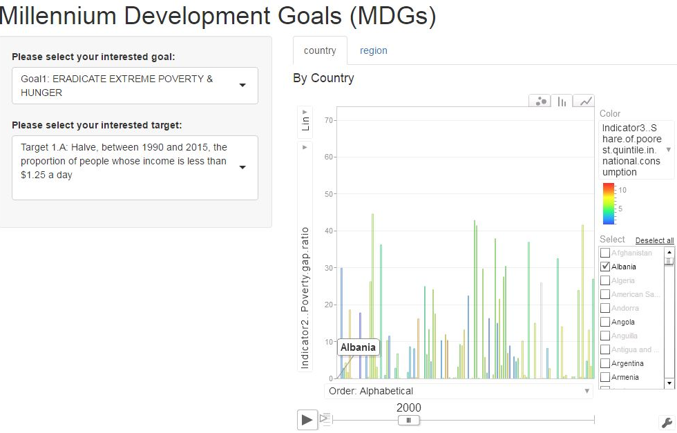
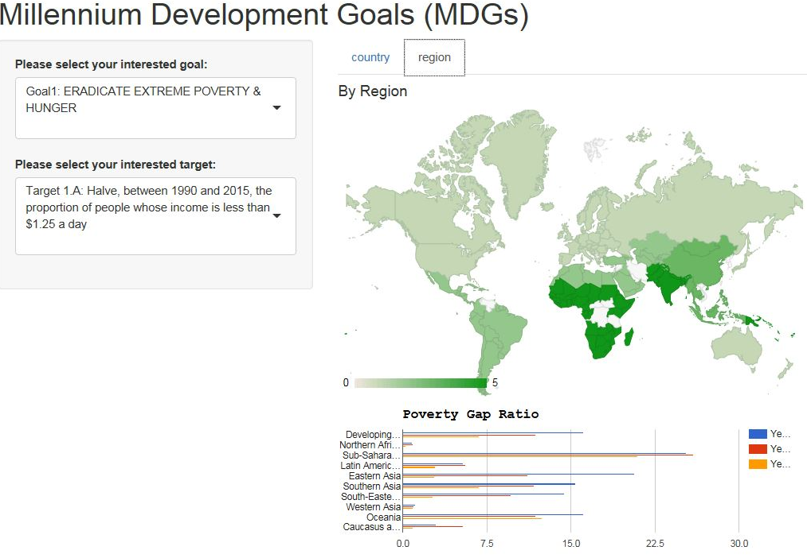

## Project Overview

The presentation is made in the context of the course "Developing Data Products". The goal of the presentation is to create a Shiny application demonstrating how the Millennium Development Goals have been achieved by country and by region.

The application "Millennium Development Goals (MDGs)" is deployed here: https://guanlinhou.shinyapps.io/MDGs/

The dataset used and source code for ui.R and server.R files can be found here: https://github.com/guanlinhou/Shiny-App-course-project

--- .class #id

## Shiny Application Functionality 
Use this app to understand how well each of the 8 goals has been achieved by different target dimensions. 

You can view the country tab by three types of graphs - Scatter, Column, or line. For each of the combination of goals and targets, we have different indicators for you to compare between countries, or the same countries over time (y axis). You can change the order of the countries shown in the graphs by different dimensions in x axis.

You can choose automatic playing under Scatter and Column to view different year data.

You can choose speicific country to focus on, and have different colour/size options for countries.

The region tab has two parts. The bottom chart shows the indicator for a combination of goal and target for Year 1990, Year 2000, and Year 2010. You can compare the same region change over decades, or compare different regions during the same time period.

The top geographic map ranks different regions on a scale from 0 to 5 based on the caculated result in the bottom chart.

---  .class #id

## Shiny Application Functionality - Country tab (Example)

<!-- Limit image width and height -->

 
<!-- Center image on slide -->

---  .class #id

## Shiny Application Functionality - Region tab (Example)

